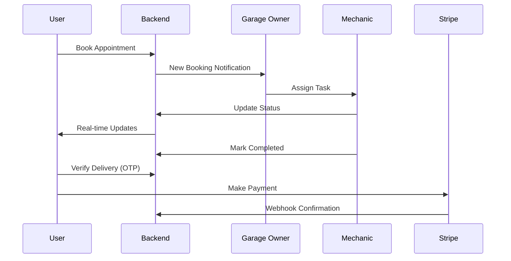

# 🚗 Garage24

Garage24 is a **multi-role vehicle service management platform** that enables users to book vehicle services, track every stage of the service lifecycle, and make secure online payments.

The platform connects **customers, garage owners, mechanics, and admins** into a single system with **real-time tracking, live communication, and secure delivery verification**.

---

# 🌐 Platform Overview

Garage24 solves common service management problems:

* Difficulty tracking vehicle service progress
* Lack of communication between customer and service provider
* Manual appointment handling
* Unclear pricing and service updates

The platform provides:

* 📅 Structured appointment booking
* 🔄 Real-time service tracking
* 💬 Live communication
* 🔐 Secure delivery using OTP
* 💳 Seamless payment integration

---

# 👥 Roles in the System

* **User (Customer)**
* **Garage Owner (Service Provider)**
* **Mechanic**
* **Admin**

---

# 🚀 Core Features

## 👤 User Features

* Google Authentication & OTP Login
* Book vehicle service appointments
* Real-time appointment tracking
* Live chat with service provider
* Live notifications
* Secure delivery confirmation via OTP
* Online payment using Stripe
* Subscription plans
* Reviews & ratings

---

## 🏢 Garage Owner Features

* Dashboard overview
* Revenue reports
* Manage appointments
* Assign tasks to mechanics
* Track service progress
* Communicate with users in real-time

---

## 🔧 Mechanic Features

* View assigned services
* Update service progress
* Communicate with garage owner
* Mark job stages

---

## 🛠️ Admin Features

* Manage subscription plans
* Monitor revenue reports
* Platform-level control

---

# ⚙️ Core Systems

Garage24 includes several powerful backend systems:

* 🔔 Real-time notifications
* 📧 Email system (Nodemailer)
* 🖼️ Image uploads (Cloudinary / S3)
* ⭐ Review & rating system
* 💬 Live chat system (Socket.IO)
* 🔐 OTP-based delivery verification (Redis)

---

# 🔄 Appointment Flow



---

# 💬 Real-time System

Garage24 uses **Socket.IO** for:

* Live chat (User ↔ Garage ↔ Mechanic)
* Instant notifications
* Appointment status updates

---

# 💳 Payment Integration

* Integrated with **Stripe**
* Secure payment flow
* Webhook-based payment verification

---

# 🔐 Authentication System

* JWT-based authentication
* Access & Refresh tokens
* Google OAuth login
* OTP verification
* Role-based access control

---

# 🧠 Special / Unique Features

* 📍 Real-time appointment tracking
* 💬 Live group chat system
* 🔔 Live notifications
* 🔐 OTP-based service completion verification
* 📊 Revenue analytics for service providers
* 📦 Subscription-based access model

---

# 🧑‍💻 Tech Stack

## Frontend

* React
* TypeScript
* Tailwind CSS

---

## Backend

* Node.js
* Express.js
* Repository Pattern Architecture

---

## Database

* MongoDB

---

## Realtime & Caching

* Socket.IO
* Redis

---

## Other Integrations

* Stripe (Payments)
* JWT (Authentication)
* Nodemailer (Emails)
* Cloudinary / AWS S3 (File uploads)

---

# 🏗️ Project Architecture

Garage24 follows a **Repository Pattern** for scalable backend development.

### Backend Structure

```
src/
├── controllers/
├── repositories/
├── services/
├── models/
├── routes/
├── middleware/
└── utils/
```

---

### Frontend Structure

```
src/
├── components/
├── pages/
├── hooks/
├── services/
├── store/
└── utils/
```

---

# ⚙️ Installation

## Clone the repository

```bash
git clone https://github.com/your-username/garage24.git
cd garage24
```

---

## Install dependencies

### Backend

```bash
cd backend
npm install
```

### Frontend

```bash
cd frontend
npm install
```

---

# ▶️ Running the Project

### Start Backend

```bash
npm run dev
```

### Start Frontend

```bash
npm run dev
```

---

# 🐳 Deployment

* **Backend:** AWS EC2 (Dockerized)
* **Frontend:** AWS Amplify

---

# 🔐 Environment Variables

## Backend

```env
PORT=3000
JWT_SECRET=
REFRESH_JWT_SECRET=
RESET_PASSWORD_SECRET=
ACCESS_TOKEN_MAX_AGE=
REFRESH_TOKEN_MAX_AGE=

NODEMAILER_EMAIL=
NODEMAILER_PASSWORD=

BCRYPT_SALT_ROUNDS=

GOOGLE_CLIENT_ID=
GOOGLE_CLIENT_SECRET=

CLOUDINARY_CLOUD_NAME=
CLOUDINARY_API_KEY=
CLOUDINARY_API_SECRET=

AWS_S3_ACCESSKEY=
AWS_S3_SECRET=
AWS_REGION=
AWS_S3_BUCKET=

REDIS_CLIENT_CONNECTION=

STRIPE_SECRET_KEY=
STRIPE_PUBLISHABLE_KEY=
WEBHOOK_SECRET_KEY=

NODE_ENV=

LOCAL_CLIENT_URL=
PROD_CLIENT_URL=
PROD_CLIENT_BASE_URL=

MONGODB_URI=
GROQ_API_KEY=
```

---

## Frontend

```env
VITE_P_API_BASE_URL=
VITE_API_BASE_URL=http://localhost:3000/api

VITE_P_BACKEND_URL=
VITE_BACKEND_URL=http://localhost:3000

VITE_GOOGLE_CLIENT_ID=
VITE_GOOGLE_CALLBACK_URL=

VITE_FETCH_LOCATION_BASEURL=https://nominatim.openstreetmap.org/reverse
```

---

# 🔒 Security

Garage24 implements:

* JWT authentication
* OTP verification
* Role-based authorization
* Secure payment handling (Stripe webhooks)
* Encrypted credentials & environment variables

---

# 🚀 Future Improvements

* 📱 Mobile application
* 🤖 AI-based service recommendations
* 📍 Location-based garage suggestions
* 📊 Advanced analytics dashboard

---

# 👨‍💻 Author

**Ahammed Natharassah Junaid**
MERN Stack Developer